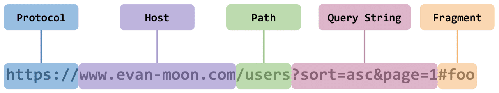

# CORS 란?

- Cross Origin Resource Sharing
- 한국어로 교차-출처 리소스 공유라고 함

## 출처가 뭔데?

URL 의 구조는 사진처럼,
Protocol, Host, Path 등으로 이루어져 있다.
(port번호는 기본 번호가 정해져있기 때문에 생략가능하다)

이때, 출처는 **Protocol, Host, 포트번호**를 의미한다. 즉, 서버의 위치를 찾기 위해 필요한 가장 기본적인 것들을 합쳐놓은 것.

**세 개가 같다면 같은 출처, 아니라면 다른 출처**라는 것이다!

## 출처를 비교하는 것? SOP

**출처가 완벽하게 같아야 데이터를 응답**해주는 보안 정책

- Same-Origin-Policy
- 다른 origin의 리소스와 상호작용하는 것을 제한하는 보안 정책이다.
- 출처가 다르면 아예 응답을 하지 않는다.

but, 웹에서는 다양한 리소스를 가져와서 사용하기 때문에 한계가 존재
=> SOP에 대한 예외 조항을 두고 허용하기로 함
=> **CORS 정책을 지킨 리소스 요청**

## CORS 작동방식

### Simple Requests 단순 요청

- 한 번에 요청과 응답을 주고받는 것

1. 웹에서 다른 출처로 리소스를 요청할 때는 HTTP 프로토콜을 사용하여 요청을 보낸다. 이 때 브라우저는 Origin 필드에 요청을 보내는 출처를 담아서 보낸다.
2. 이후 서버가 이 요청에 대한 응답을 하는데 헤더에 Access-Control-Allow-Origin 라는 값에 허용된 출처를 같이 보내준다.
3. 응답을 받은 브라우저는 자신이 보낸 Origin 과 Access-Control-Allow-Origin을 비교한 후 이 응답이 유효한지 판별한다. (CORS 에러 여부)

### Preflighted Requests 사전 요청

- 본 요청 전에 사전 요청 진행, 총 2번 요청
- 주로 사용하는 방식

### Credentialed Requests 인증된 요청

- 보안을 좀 더 강화하고 싶을 때 사용됨
- 요청에 인증과 관련된 정보(쿠키)를 담을 수 있게 해주는 옵션
- 옵션값
  - same-origin(기본값) : 같은 출처간 요청에만 인증 정보를 담을 수 있다
  - include : 모든 요청에 인증 정보를 담을 수 있다
  - omit : 모든 요청에 인증 정보를 담지 않는다.

## CORS 오류 해결 방법

### 서버 개발자와 소통한다

### 개발 환경 프록시 설정

### 프록시 서버 사용하기

- **프록시 서버**는 클라이언트가 프록시 서버 자신을 통해서 다른 네트워크 서비스에 간접적으로 접속할 수 있게 해준다. (쉽게 말해, 중계서버라고 생각하면 됨)

- 이 서버를 사용하면 중간에 요청을 가로채서 HTTP 응답 헤더에 **`Access-Control-Allow-Origin: *`** 를 설정해준다!
