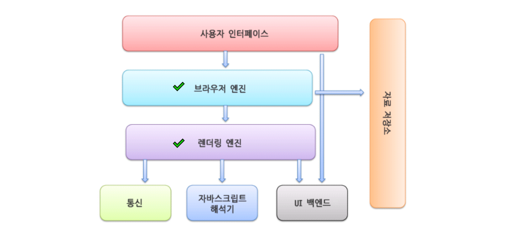
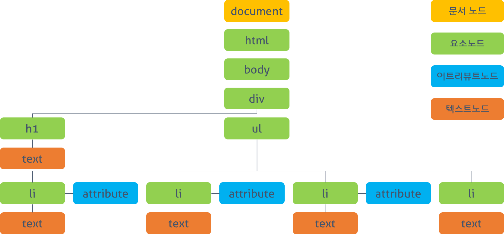

# 인터넷 브라우저의 구조

1. 사용자 UI
    - 페이지를 보여주는 창 외의 다른 UI를 말합니다. 예를 들어, 주소 표시줄, 이전 이후 버튼, 홈버튼 등이 있어요.

2. 브라우저 엔진
    - 사용자 UI와 렌더링 엔진 사이에서 동작을 제어합니다. UI 스레드, 네트워크 스레드, 스토리지 스레드 등이 존재해요.

3. 렌더링 엔진
    - 웹페이지가 표시되는 모든 영역을 말합니다. 요청한 컨텐츠들을 파싱하고 화면에 그리는 일을 해요.

4. 자료 저장소
    - 로컬에서 자료를 저장하는 쿠키나 Local Storage가 있어요

5. 통신
    - HTTP/ HTTPS 통신을 해요.

6. 자바스크립트 엔진
    - 렌더링 엔진이 HTML 파싱 중 `script`태그를 만나면 JS 엔진이 권한을 부여받아 파싱해요. 이 작업은 동기적으로 일어납니다.

7. 백엔드 UI
    - 기본 위젯을 그릴 때 이용해요.

# DOM 트리

Document Object Model 의 줄임말로 객체로 표현된 HTML 문서라는 뜻입니다.

브라우저는 HTML 문서를 바로 읽을 수 없기 때문에 이를 **객체의 형태로 바꾸어 브라우저가 읽을 수 있는 트리 구조**로 변환해줍니다. 이것을 DOM 트리라고 해요.

DOM 트리 내 하나의 객체는 노드라고 불러요.

- 문서 노드 : 트리의 최상위 객체이고 시작점
- 요소 노드 : HTML 태그를 객체로 표현
- 어트리뷰트 노드 : HTML 요소의 `Attribute`를 객체로 표현
- 텍스트 노드 : HTML 요소의 `text`를 객체로 표현