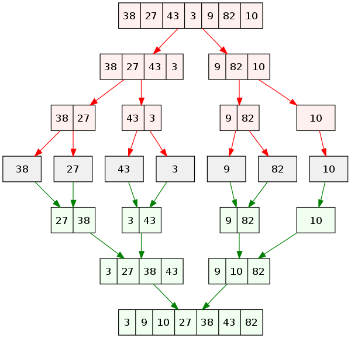

# 병합정렬 Merge Sort

일단 **반으로 나누고 나중에 합쳐서 정렬**하자

- 정렬하고자 하는 데이터를 반복하여 두 부분으로 나눈뒤(배열의 길이가 1이 될 때까지)
- 나누어진 부분 데이터들을 정렬한 다음에 다시 병합하면서 하나의 정렬된 데이터를 만든다.

- **'분할 정복'** 방법을 채택한 알고리즘

## 시간복잡도

- **O(N * logN)**
    - 퀵정렬은 피벗 값에 따라 편향되게 분할할 가능성이 있다는 점에서 최악의 경우 O(N^2) 의 시간복잡도를 가짐.
    - 그러나, 병합정렬은 정확히 반씩 나눈다는 점에서 최악의 경우에도 **O(N * logN)** 을 보장.

시작 - [7,6,5,8,3,5,9,1]
1번째 - `6, 7` `5, 8` `3, 5` `1, 9`
2번째 - `5, 6, 7, 8` `1, 3, 5, 9`
3번째 - `1, 3, 5, 5, 6, 7, 8, 9`

=> 합치는 순간에 정렬을 수행한다.
=> 합치는 단계는 3단계면 ok (8 = 2^3)



## 코드

- `merge()` : 두 개의 배열을 합치는 함수
- `mergeSort()` : 배열을 분할하고 병합하는 재귀함수

```js
function merge (left, right) {
    let resultArr = [];
    let leftIndex = 0;
    let rightIndex = 0;

    // 왼쪽 배열과 오른쪽 배열의 값을 비교하면서 결과 배열에 추가
    while (leftIndex < left.length && rightIndex < right.length) {
        if (left[leftIndex] < right[rightIndex]) {
            resultArr.push(left[leftIndex]);
            leftIndex++;
        } else {
            resultArr.push(right[rightIndex]);
            rightIndex++;
        }
    }

    // 남은 값들을 결과 배열에 추가
    return resultArr.concat(left.slice(leftIndex)).concat(right.slice(rightIndex))
}

function mergeSort (arr) {
    if (arr.length <= 1) {
        return arr
    }

    const middle = Math.floor(arr.length/2);
    const left = arr.slice(0, middle);
    const right = arr.slice(middle);

    return merge(mergeSort(left), mergeSort(right));
}
```