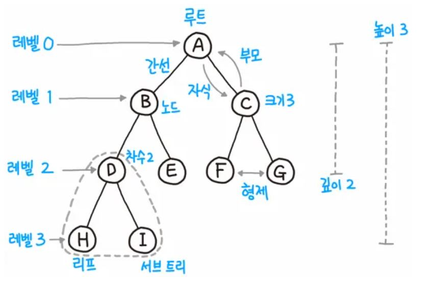

# 트리 Tree

- 부모, 자식 관계
- 부모에서 자식까지 이어져 있는 그래프

## 용어

- 트리는 항상 root에서부터 시작된다.
- 루트는 자식 노드를 가지며, 간선으로 연결되어 있다.
    - **노드** : 트리를 구성하는 기본 원소
    - 루트 노드 : 트리에서 부모가 없는 최상위 코드, 트리의 시작점
    - 부모 노드 : 루트 노드 방향으로 직접 연결된 노드
    - 자식 노드 : 루트 노드 반대 방향으로 직접 연결된 노드
    - 형제 노드 : 같은 부모 노드를 갖는 노드들
    - 리프 노드 : 자식이 없는 노드, 단말 노드라고도 함
- 차수(degree) : 자식 노드의 개수
- **크기(size)** : 자신을 포함한 모든 자식 노드의 개수
- 레벨은 보통 0부터 시작

[나무위키](https://namu.wiki/w/%ED%8A%B8%EB%A6%AC(%EA%B7%B8%EB%9E%98%ED%94%84))