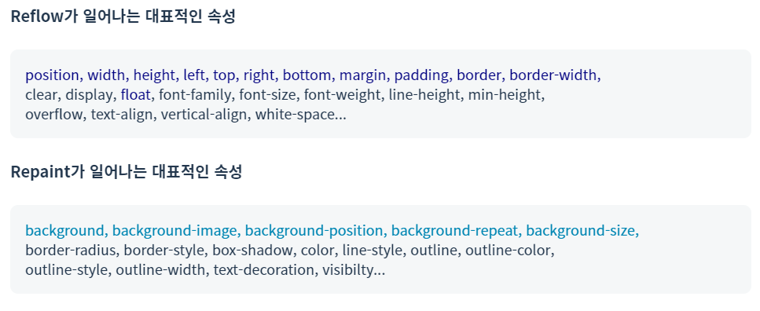

[브라우저](./%EB%B8%8C%EB%9D%BC%EC%9A%B0%EC%A0%80.md) 에서 이어집니다.

# 주소창에 naver.com 을 치면 일어나는 일!

1. 브라우저가 이 텍스트가 검색어인지 URL인지 먼저 확인합니다.

    1-1. 검색어이면, 검색 엔진의 URL에 검색어를 포함한 주소로 페이지를 이동시킵니다.

    1-2. URL이면, 브라우저 엔진에서 네트워크 호출을 합니다.

2. 네트워크 호출

    2-1. 자신의 host 파일에서 `naver.com`에 대응하는 IP주소가 있는지 확인합니다.
    
    만일 없다면, DNS 서버에 요청을 보내 IP 주소를 받습니다.

    2-2. 클라이언트 브라우저는 네이버 서버에 데이터를 요청하는 HTTP Request를 보냅니다.

    요청을 받은 네이버 서버는 문서를 찾아 읽고 바이트 형태로 변환한 후 HTTP Response 를 보냅니다.

3. 렌더링 과정

    3-1. 브라우저 엔진은 네이버 서버로부터 받은 데이터에 악성 바이러스가 있는지 확인합니다.

    렌더링 엔진에게 데이터를 해석하여 화면에 띄울 것을 요청합니다.

    3-2. 렌더링 엔진은 받은 데이터를 바탕으로 렌더링 프로세스를 수행하고 완료되면 작업 완료를 알립니다.

이제 네이버 페이지가 화면에 보여집니다!

# 렌더링 프로세스

렌더링 엔진은 브라우저 엔진으로부터 데이터를 받아서 화면에 그려주는 역할을 합니다.

> **파싱이란 ?** 브라우저는 단순한 텍스트 문서를 이해하지 못하므로 브라우저가 이해할 수 있는 구조로 변환해주는 과정을 파싱이라고 합니다.

1. HTML 파싱하여 DOM 트리 구축, CSS 파싱하여 CSSOM 트리 구축, JS 파싱

- 1-1 **HTML 파싱 -> DOM 트리 생성**
    - 렌더링 엔진은 파싱 과정을 기다리지 않고 배치와 그리기를 미리 진행합니다.

- 1-2. **CSS 파싱 -> CSSOM 트리 생성**
    - HTML 파싱 중 `link` 태그를 만나면 DOM 생성이 잠시 중단되고 CSS 파싱이 시작됩니다.

- 1-3. **JS 파싱**
    - HTML 파싱 중 `script` 태그를 만나면 DOM 생성을 중단하고 JS엔진에게 권한을 넘겨줍니다.

    - `script` 태그를 `body` 태그 중간에 작성할 경우, HTML 파싱이 끝나지 않은 상태에서 DOM이 조작되어 에러 발생 위험이 생깁니다. 따라서 **`script` 태그는 반드시 `body` 태그 내부의 최하단**에 위치해야 합니다.

2. DOM 트리와 CSSOM 트리를 통해 **렌더 트리 구축**

    - 2-1. 렌더 트리 생성를 생성합니다.(DOM 트리 + CSSOM 트리)

    > **렌더 트리란?** 
    > 실제 화면에 표현되는 노드들로만 구성된 트리 (화면상에서 공간을 차지하는)

3. 렌더 트리 배치 **Layout**
    - 렌더 트리의 노드들을 화면에 배치하는 과정입니다.

    - 글로벌 레이아웃 : 전체 배치과정이 필요한 경우
        - 맨 처음 레이아웃이 발생할 때, 초기 배치 이후 전역 스타일이 변경되거나 창이 리사이즈 될 때
        - 초기 배치 이후 레이아웃 작업이 다시 일어나는 것을 리플로우 **Reflow** 라고 합니다.

    - 로컬 레이아웃 : 일부만 변경하면 되는 경우로 전체 배치과정이 다시 일어나 불필요한 낭비가 발생하는 상황을 막아줍니다. (모두 리플로우에 들어감)

    > Reflow가 일어나는 경우  
    >
    > 페이지 초기 렌더링시, 브라우저 리사이징시, 노드 추가 또는 제거, DOM 노드 위치/크기 변경, 폰트 변경, 이미지 크기 변경

4. 렌더 트리 그리기 **Paint**

    - 레이아웃 과정에서 계산된 정보들을 바탕으로 각 노드를 화면에 그려주는 과정입니다. 화면의 실제 픽셀로 변환해주는 과정으로 래스터화 Rasterizing 라고 합니다.

    - Reflow 된 렌더 트리를 다시 화면에 그려주는 과정을 Repaint라고 합니다. Reflow가 발생하지 않아도 `background-color`나 `opacity` 같이 레이아웃에 영향을 주지 않는 스타일 속성이 변했을 때는 Repaint만 일어납니다.

    > **Reflow vs Repaint**  
    > Reflow는 뷰포트 내에서 렌더 트리 노드의 정확한 위치와 크기를 계산하는 과정. 화면의 구조가 바뀌었을 때 발생합니다.  
    > Repaint는 화면에 변화가 있을 때 화면을 다시 그리는 과정으로 화면이 변경되는 모든 경우에 발생합니다.

## 렌더링을 최적화하기 위해서는

1. Reflow를 최소화하자

    Reflow가 발생하면 필연적으로 Repaint가 일어나기 때문에 렌더링 최적화에 좋지 않습니다. 따라서 Repaint만 발생하는 속성을 사용하는 것이 좋습니다.

2. CSS와 JS로 인한 비효율 줄이기

    `<link>`, `<style>` 태그 `<head>` 태그 안에 배치
    미디어 유형, 미디어 쿼리 이용하기 (해당 조건에 부합될때만 로드되므로)

    `<script>` 태그 `<body>` 최하단 위치하기
    `<script>`에 `async` `defer` 속성 부여

3. 영향을 주는 노드 최소화하기

    `position`을 `absolute`나 `fixed` 사용하면 영향을 받는 주변 노드들을 줄일 수 있습니다.

    `fixed`와 같이 영향을 받는 노드가 전혀 없는 경우 Reflow 과정이 필요없고 Repaint 연산 비용만 들게 되니까 효율적입니다.

[주소창에 naver.com 을 치면 일어나는 일](https://velog.io/@sylagape1231/%EC%A3%BC%EC%86%8C%EC%B0%BD%EC%97%90-naver.com%EC%9D%84-%EC%B9%98%EB%A9%B4-%EC%9D%BC%EC%96%B4%EB%82%98%EB%8A%94-%EC%9D%BC%EC%9D%84-%EC%89%BD%EA%B2%8C-%EC%9D%B4%ED%95%B4%ED%95%B4%EB%B3%B4%EC%9E%90)  
[내 화면에 네이버가 켜지는 과정](https://velog.io/@jhyun_k/%EB%82%B4-%ED%99%94%EB%A9%B4%EC%97%90-%EB%84%A4%EC%9D%B4%EB%B2%84%EA%B0%80-%EC%BC%9C%EC%A7%80%EB%8A%94-%EA%B3%BC%EC%A0%95)
