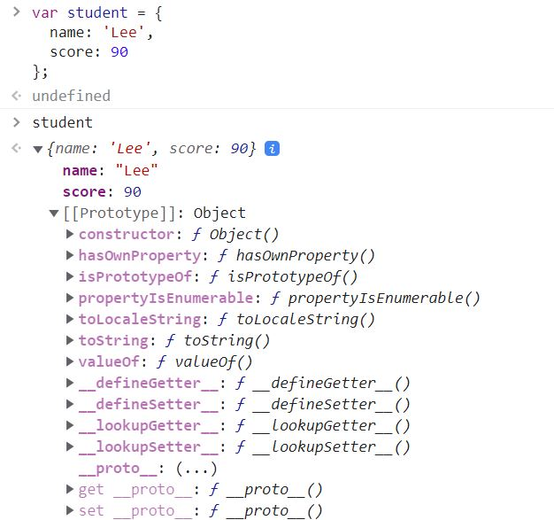

# 자바스크립트의 객체 생성 방법

클래스 기반 언어는 클래스를 사전에 정의하고 필요한 시점에 new 연산자를 사용하여 객체를 생성한다.
클래스가 없는 자바스크립트는 어떻게 객체를 생성할까?

## 1. 객체 리터럴

- 가장 일반적인 객체 생성 방식이다.
- **중괄호({})**를 사용하여 객체를 생성한다.
- 중괄호 안에 아무것도 쓰지 않으면 빈 객체가 생성된다.

## 2. Object 생성자 함수

- new 연산자와 Object 생성자 함수를 호출하여 빈 객체를 생성한다.
- 빈 객체를 생성한 후 프로퍼티 또는 메소드를 추가하여 객체를 완성한다.
  > **생성자 함수**란, new 키워드와 함께 객체를 생성하고 초기화하는 함수이다. 생성자 함수를 통해 생성된 객체를 **인스턴스(instance)**라고 한다.

```js
// 빈 객체 생성
let person = new Object();
// 프로퍼티 추가
person.name = "Kim";
person.gender = "female";
person.sayHello = function () {
  console.log(`Hi! My name is ${this.name}`);
};

console.log(typeof person); // object
console.log(person); // {name: 'Kim', gender: 'female', sayHello: f}
person.sayHello(); // Hi! My name is Kim
```

## 3. 생성자 함수

- 객체 리터럴 방식과 Object 생성자 함수 방식으로 객체를 생성하는 것은 프로퍼티 값만 다른 여러 개의 객체를 생성할 때 불편하다. 왜냐하면 동일 프로퍼티를 갖는 객체임에도 매번 같은 프로퍼티를 서술해야 하기 때문이다.
- 생성자 함수를 사용하면 프로퍼티가 동일한 객체 여러개를 간편하게 생성할 수 있다.

```js
// 생성자 함수
function Person(name, gender) {
  let age = 26;
  this.name = name;
  this.gender = gender;
  this.sayHello = function () {
    console.log(`Hi! My name is ${this.name}`);
  };
}
// 인스턴스 생성
let person1 = new Person("Kim", "female");
let person2 = new Person("Lee", "male");

console.log(typeof person1); // object
console.log(person1); // {name: 'Kim', gender: 'female', sayHello: f}
console.log(person1.gender); // 'female'
console.log(person1.age); // undefined
```

> 생성자 함수 이름은 대문자로 시작한다.
> 프로퍼티 또는 메소드명 앞에 기술한 `this`는 생성자 함수가 생성할 **인스턴스**를 가리킨다.
> 생성자 함수 안에서 선언된 일반 변수(age)는 `private` 하다. 외부에서 접근할 수 없다.
> this에 연결되어 있는 프로퍼티와 메소드는 `public` 하다.

<br>

위의 세가지 방법으로 객체를 생성하는 것을 알게 되었다.

자바스크립트의 모든 객체는 부모 역할을 담당하는 객체와 연결되어 있다. 그리고 부모 객체의 프로퍼티 또는 메소드를 상속받아 사용할 수 있게 한다.

이러한 부모 객체를 **Prototype 프로토타입 객체**라고 한다.

자바스크립트의 모든 객체는 `[[Prototype]]` 이라는 인터널 슬롯을 가진다.



`[[Prototype]]` 의 값은 null 또는 프로토타입 객체이며 상속을 구현하는데 사용된다.


[프로토타입 참조](https://poiemaweb.com/js-prototype)