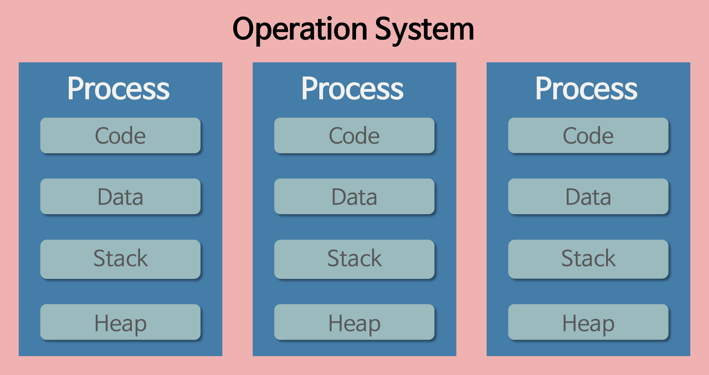
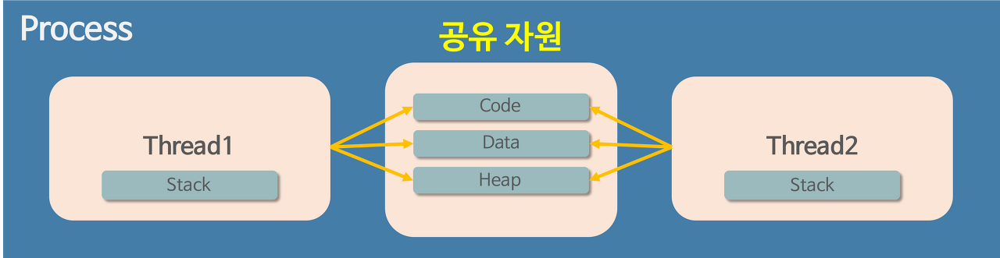

# 프로세스 Process 란?

- 운영체제로부터 자원을 할당받은 작업의 단위

> **프로그램**은 파일이 저장장치에 저장되어 있지만 메모리에 올라가 있지 않은 정적인 상태이다. (예를 들어, .exe 파일 같은 눌러서 실행하기 전의 파일들)
>**프로세스**는 프로그램을 실행하여 동적인 상태의 프로그램을 말한다.

- 프로세스가 메모리에 올라갈 때 운영체제로부터 시스템 자원을 할당받는다. 프로세스마다 각각의 독립된 메모리 영역을 Code, Data, Stack, Heap 형식으로 할당해준다. 독립된 영역이므로 프로세스는 다른 프로레스에 접근할 수 없다.

# 스레드 Thread 란?

- 프로세스가 할당받은 자원을 이용하는 **실행 흐름**의 단위

- 스레드는 프로세스와 다르게 프로세스가 할당받은 영역 내에서 Code, Data, Heap 형식으로 할당된 메모리를 공유한다.
- 각각의 스레드는 별도의 Stack을 가지고있지만 힙 메모리는 서로 읽고 쓸 수 있게 된다.

- 예를 들어, 크롬 브라우저가 실행되는 순간, 프로세스가 하나 생성된다. 사용자는 브라우저에서 하나의 작업만 수행하지 않는다. (온라인 쇼핑을 하면서, 카톡도 할 수 있고, 유튜브로 노래도 들을 수 있는 것처럼) 이처럼 하나의 프로세스 안에서도 여러가지 작업이 동시에 실행될 수 있다. 동시에 진행되는 작업들을 **스레드** 라고 부른다.

# 싱글 스레드와 멀티 스레드

## 싱글 스레드

- 하나의 프로세스에서 오직 하나의 스레드로만 실행한다.

### 장점
1. 자원 접근을 위한 동기화를 신경쓰지 않아도 된다.
2. 난이도가 쉽고, CPU, 메모리를 적게 사용한다.
3. 컨텍스트 스위칭 작업을 요구하지 않는다. 비용 절감

### 단점
1. 여러 개의 CPU를 활용하지 못한다.
2. 연산량이 많은 작업의 경우, 그 작업이 완료되어야 다른 작업을 수행할 수 있다.
3. 에러 처리가 안될 경우 멈춘다. (멀티 스레드의 경우 새로운 스레드를 생성하여 극복함)

## 멀티 스레드

- 프로그램의 둘 이상을 동시에 실행
- 하나의 스레드에서 다음 스레드로 이동하면서 **컨텍스트 스위칭**이 일어난다. 

> **컨텍스트 스위칭**이란, 프로세스 하나가 여러가지 작업을 돌아가면서 일부분씩 진행하는 것을 말한다. 이 과정이 빠르게 진행되므로 마치 모든 작업들이 동시에 진행되는 것처럼 느껴지는 것이다. => **동시성**

### 장점 
1. 공유하고 있는 메모리만큼 메모리 자원을 아낄 수 있다.
2. 스레드는 프로세스 내의 stack 영역을 제외한 모든 메모리를 공유하기 때문에 통신의 부담이 적고 응답 시간이 빠르다.

### 단점
1. 스레드 하나가 프로세스 내 자원을 망친다면 모든 프로세스가 종료될 수 있다.
2. 자원을 공유하기 때문에 동기화가 필요하다.
3. 프로그래밍 난이도가 높다.

# 자바스크립트?

- **자바스크립트는 싱글 스레드 언어이다**.
- 조금 더 경량 프로그래밍 언어를 도입하기 위해 만들어진 것

## 자바스크립트를 멀티 스레드처럼 사용 가능한 이유는?

- 자바스크립트가 아닌 브라우저에 내장된 기능들을 사용함으로써 비동기 처리를 할 수 있다. (**Web API, EventLoop, Taskque**)

[싱글스레드 vs 멀티스레드](https://velog.io/@gil0127/%EC%8B%B1%EA%B8%80%EC%8A%A4%EB%A0%88%EB%93%9CSingle-thread-vs-%EB%A9%80%ED%8B%B0%EC%8A%A4%EB%A0%88%EB%93%9C-Multi-thread-t5gv4udj)
[프로세스와 스레드](https://velog.io/@gil0127/%EC%8B%B1%EA%B8%80%EC%8A%A4%EB%A0%88%EB%93%9CSingle-thread-vs-%EB%A9%80%ED%8B%B0%EC%8A%A4%EB%A0%88%EB%93%9C-Multi-thread)
[프로세스와 스레드의 차이](https://velog.io/@raejoonee/%ED%94%84%EB%A1%9C%EC%84%B8%EC%8A%A4%EC%99%80-%EC%8A%A4%EB%A0%88%EB%93%9C%EC%9D%98-%EC%B0%A8%EC%9D%B4)