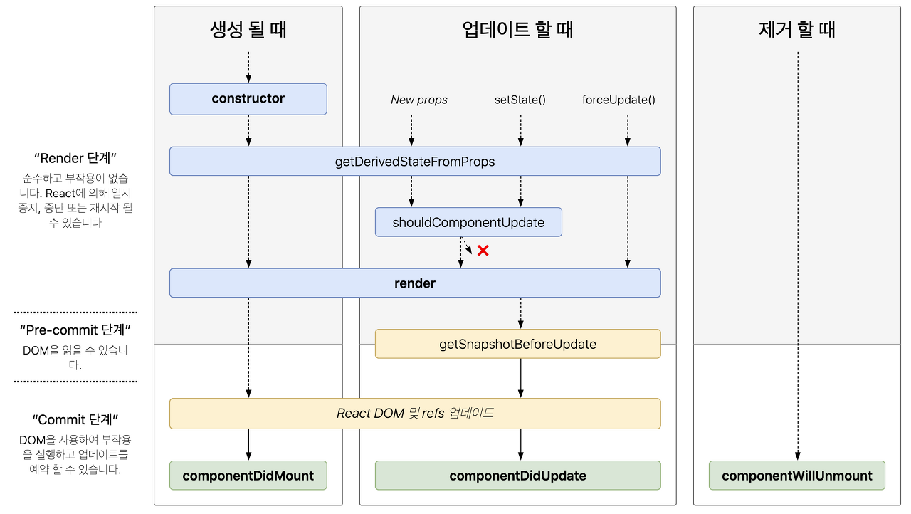

# 리액트의 라이프 사이클

리액트의 모든 컴포넌트는

생성 **Mount** -> 업데이트 **Update** -> 제거 **Unmount**

주기를 갖습니다.

클래스 컴포넌트는 라이프 사이클 메소드를 활용하고 함수형 컴포넌트는 Hook을 통해 업데이트합니다.

## 라이프 사이클 메소드

마운드 -> 업데이트 -> 언마운트



### 1. 마운트 (생성)

- 컴포넌트의 인스턴스가 생성되어 DOM에 삽입될 때 순서대로 호출됩니다.

- 1. constructor()
     컴포넌트를 새로 만들 때마다 호출되는 클래스 생성자 메소드. `this.props`, `this.state` 에 접근 가능.
- 2. getDerivedStateFromProps()
     props에 있는 값을 state에 동기화
- 3. render()
     UI 렌더링
- 4. componentDidMount()
     첫 렌더링 마친 후 호출. 라이브러리나 프레임워크의 함수를 호출. 비동기 작업처리 등.

### 2. 업데이트

- props나 state가 변경되면 순서대로 호출됩니다.

- 1. getDerivedStateFromProps()
     마운트 과정에서 호출되고 업데이트 시작 전에도 호출.
- 2. shouldComponentUpdate()
     props나 state를 변경했을 때 리렌더링을 시작할지 여부 결정
- 3. render()
     컴포넌트 리렌더링
- 4. getSnapshotBeforeUpdate()
     컴포넌트 변화를 DOM에 반영하기 직전에 호출
- 5. componentDidUpdate()
     컴포넌트 업데이트 작업이 끝난 후 호출

### 3. 언마운트 (마운트 해제)

- 컴포넌트를 DOM에서 제거하는 과정입니다.

- 1. componentWillUnmount()
     컴포넌트를 DOM에서 제거할 때 실행. 이후에 컴포넌트는 다시 렌더링되지 않음

## Reack Hook

- 상태관리 로직을 추상화하여 독립적인 테스트와 재사용이 가능하게 하기 위해 리액트 훅을 도입하게 되었습니다.

- Hook을 사용할 때는 두가지 규칙이 있어요.
  - 최상위에서만 Hook을 호출하기
  - 리액트 함수 컴포넌트에서만 Hook 호출 가능

### useState

동적으로 바뀌는 값을 관리할 때 사용하며 상태유지 값과 그 값을 갱신하는 함수를 반환합니다.

```js
const [state, setStae] = useState(initialState);
```

최초 렌더링 => state는 initialState 값
다음 렌더링 => useState 통해 반환된 최신 state 값

### useEffect

리액트 컴포넌트가 렌더링될 떄마다 작업을 실행할 수 있도록 하는 Hook입니다. 컴포넌트가 **mount, update, unmount** 되면 작업을 처리할 수 있습니다.

useEffect는 클래스 컴포넌트에서 사용하는 리액트 라이프 사이클 메소드의 4가지 기능을 모두 수행합니다.

- componentDidMount
- componentDidUpdate
- componentWillUnmount
- getDerivedStateFromProps

```js
useEffect(callbackFunc, deps);
```

deps에 아무것도 안오면 => 렌더링 될때마다 실행. mount, update, unmount
deps에 빈배열 => 최초 렌더링시. componentDidMount
deps에 [state1] => 최초 렌더링, state1이 변경될 때 실행. componentDidUpdate, getDerivedStateFromProps

```js
useEffect(() => {
  return () => func;
});
```

위와 같이 `return` 문이 오면 이를 clean-up 함수라고 합니다. clean-up 함수는 컴포넌트가 unmount될 때 정리하거나 unscribe 해야할 것을 정리하여 메모리 누수를 방지합니다. componentWillUnmount

> **useEffect**로 전달된 함수는 `컴포넌트렌더링 -> 화면 업데이트 -> useEffect 실행` 순으로 실행되기 때문에 **최소 렌더링 이후에 실행**됩니다!

> 화면을 다 그리기 전에 동기화되어야 하는 경우 `useLayoutEffect()` 를 활용하여 실행시킬 수 있습니다. `렌더링 -> useLayoutEffect -> 화면 업데이트` 순

[리액트의 생명주기와 useEffect Hook](https://velog.io/@sukong/REACT-%EB%A6%AC%EC%95%A1%ED%8A%B8%EC%9D%98-%EC%83%9D%EB%AA%85%EC%A3%BC%EA%B8%B0%EC%99%80-useEffect-Hook)