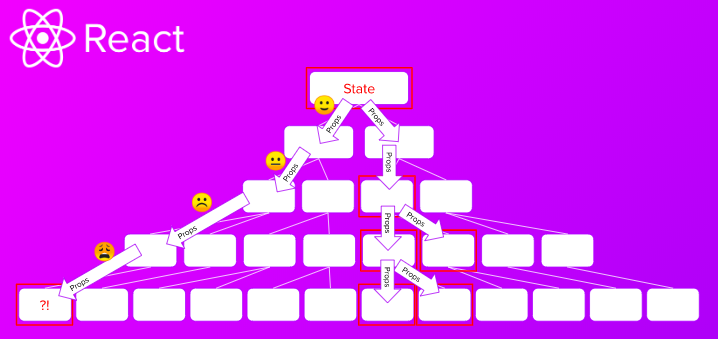

let's GIT it 프로젝트가 완성되고 내가 썼던 코드들을 보면서 리팩토링 과정을 하고 있다.

코드를 하나하나 뜯어보다 보니 
구조 설계가 비효율적으로 되어있다는 점을 깨달았다.

사실 개발과정 중에는 설계에 대해서는 전혀 고려하지 않고 했다. (아무도 설계의 중요성을 몰랐고 뭔지도 몰랐으니까)

처음에 프로젝트 폴더와 파일을 구성할 때 기능별로 나눴다. 크게 `main`, `Community`, `rank`, `mypage`, `login` 등등.. 그리고 그 폴더 안에서 필요한 기능별로 폴더를 나누고 파일을 만들었다.

어떻게 보면 상향식으로 나눈것이다. 전체 파일에서 필요한 페이지별로 폴더를 나누고 기능별로 나눴으니까.

내가 담당한 페이지는 `Article` 인데, 여기에 글이나 댓글을 불러오고, 글이나 댓글 좋아요를 누른다거나 댓글과 대댓글을 다는 기능이 포함되어있다.

어쩌다가 이러한 폴더와 파일 구조가 만들어졌는지 이야기를 하자면 이렇다.

가장 먼저 `article.tsx` 파일에서 전체 UI 구조를 만들었다. 그 다음 하나하나 기능을 추가할 때, 독립적인 기능(댓글 달기, 댓글리스트, 대댓글리스트 등)은 새로운 파일을 만들어서 붙여넣기 하는 방식으로 진행했다.

예를 들어, 댓글 리스트를 서버에서 받아와서 그리는데 댓글 하나를 map을 돌려 화면에 그려주었다.
그러면 댓글 리스트와 댓글 한 개가 같은 컴포넌트에 있으면 안되니까 컴포넌트 분리를 해줬다. 

이런식으로 그때그때 분리해가면서 작업을 했는데 지나고나서 보니까 `이게 과연 최선의 구조일까?` 라는 생각이 들었다.

서론이 길었는데.. 그래서 프론트엔드 아키텍처에 대해 공부를 하고자 한다.

# MVC 아키텍처

- **Model, View, Controller** 영역

1. View 화면

우리가 쉽게 이해할 수 있는 **화면**이다.
대개 HTML과 CSS로 만들어지는 결과물을 말한다.

2. Model 데이터

멈춰있는 화면만 있으면 디자인과 다를게 없다. 화면에 데이터가 반영되어 나타난 것으로 **데이터가 주관하는 영역**을 말한다.

3. Controller 컨트롤러

Model의 데이터를 받아서 View에 그리고 View로부터 사용자의 동작을 받아서 Model을 변경한다.
Model와 View 사이의 중간 역할을 하는 것이 Controller이다.

## jQuery 시절의 MVC 아키텍처

프론트엔드 역할이 추가되고 Ajax 기술이 만들어지면서 MVC 개념이 바뀌게 된다.

- Model : Ajax로부터 받는 데이터
- View : HTML, CSS로 만들어지는 화면
- Controller : JS가 중간에서 서버의 데이터를 받아서 화면을 바꾸고 이벤트를 처리하여 서버에 데이터를 전달하는 역할을 수행

# MVVM 아키텍처

jQuery로 작업하다보니 불편한 점을 발견하게 된다.
데이터를 찾아서 바꾸고 수정하고 이벤트를 연결하는 과정에서 반복적인 패턴이 나타나게 된다.

이를 개선하기 위해 템플릿과 같은 선언적인 방식으로 개발을 하자! 는 목소리가 나온다.

> 선언적 프로그래밍이란, 약속된 선언을 바탕으로 자동으로 필요한 코딩을 하는것으로 html, css, jsx와 같은 템플릿이 있다.

이 때 등장한게 angular.js 이다. 템플릿과 바인딩이라는 중요 개념이 등장하였다. DOM을 조작하는 코드가 사라지고 그 기능을 프레임워크가 담당하게 된 것이다. 개발자는 화면에 그려야할 데이터만 만들어서 프레임워크에 전달해주면 알아서 그려준다.

View를 그리는 Model만 다루게 되었다는 의미로 ViewModel이라고 부르며 MVVM 이라고 부르게 되었다.

# 컴포넌트, Container-Presenter 패턴

DOM 을 잘 다루지 못하더라도 개발이 가능해졌다.
Page안에 여러가지 모듈이 있고 여러 화면이 하나의 화면에서 구성할 수 있도록 발전하게 된다.

MVVM이 **화면 단위가 아닌 작게 재사용 할 수 있는 단위**로 만들어서 조립하는 방식으로 발전했다. 이것이 **Component 패턴**이다.

컴포넌트는 재사용이 가능해야한다는 원칙에 따라 가급적 비즈니스 로직을 포함시키지 않으려고 했다.

그래서 비즈니스 로직을 분리한게 **Container-Presenter 아키텍처**이다.

Container 컴포넌트 : 비즈니스 로직을 관장하고 있는 컴포넌트
Presenter 컴포넌트 : 데이터만 뿌려주는 형태의 컴포넌트

## Props Drilling

이렇게 만들었을 때 컴포넌트가 복잡해짐에 따라 하위에 값을 전달하기 위해서는 중간 레벨에 있는 컴포넌트들이 모두 props를 가지고 있어야 하는 문제가 발생한다.

# FLUX 패턴

Props Drilling 문제를 해결하기 위해 FLUX 패턴이 등장한다.

MVC에서 벗어나서 **단일 흐름**을 만들자!

## Redux 등장

FLUX 패턴을 이용하여 Redux가 탄생했다.

View를 하나의 큰 View로 이해하고 Dispatch를 통해서 Action을 전달하면 Action은 Reducer를 통해서 Data가 Store에 보관이 되고 Store에 있는 데이터는 다시 View로 연결되는 방식이다.

> 기존의 컴포넌트 단위인 MVC 개념에서 완전히 비즈니스 로직과 View를 분리하면서 이를 **상태관리**라고 부르게 된다.

## FLUX 패턴의 한계

높은 학습곡선과 장황한 문법이 지적되었다.
간단한 구조에서는 Props Drilling 문제가 치명적이지 않았고, Action, Reducer, Dispatch 만들고 관리하는데 많은 부수적인 코드를 관리가 어려워 진다는 문제가 생겼다.